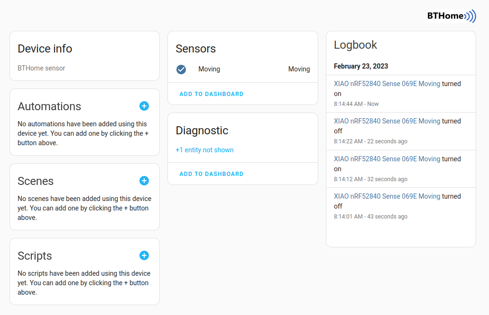

# BTHome Motion Detection in CircuitPython with the Seeed XIAO nRF52840 Sense

[](https://github.com/koenvervloesem/BTHome-Motion-Detection-in-CircuitPython/blob/main/LICENSE)

This project offers [CircuitPython](https://circuitpython.org) code to detect motion with the [Seeed XIAO nRF52840 Sense](https://www.seeedstudio.com/Seeed-XIAO-BLE-Sense-nRF52840-p-5253.html) and send Bluetooth Low Energy (BLE) advertisements in the [BTHome](https://bthome.io/) format.

This allows you to use the Seeed XIAO nRF52840 Sense as a motion detection device in Home Assistant, as the BLE advertisements in the BTHome format are supported by Home Assistant and automatically discovered when using the [BTHome integration](https://www.home-assistant.io/integrations/bthome). The code uses the [unencrypted BTHome v2 format](https://bthome.io/format/).

## Installation

* From the CircuitPython website, download the firmware file for your board, in our case [CircuitPython for the Seeed Studio XIAO nRF52840 (Sense)](https://circuitpython.org/board/Seeed_XIAO_nRF52840_Sense/). The code has been tested with CircuitPython 8.0.2.
* Connect the board to your computer via USB, and press the tiny reset button (marked RST) next to the USB connector twice in quick succession.
* A disk named **XIAO-SENSE** will now appear on your computer's file explorer. Drag and drop the downloaded UF2 file onto the disk. Then your computer disconnects the disk and mounts a new disk called **CIRCUITPY**. Your board is now ready for programming with CircuitPy.
* Download the [CircuitPython libraries](https://circuitpython.org/libraries), in particular the bundle for CircuitPython 8.x. Extract the ZIP file and copy the folders **adafruit\_bus\_device**, **adafruit\_lsm6ds** and **adafruit\_register** to the **lib** folder of your **CIRCUITPY** drive.
* You can now use the code editor [Mu](https://codewith.mu) to save the file [code.py](code.py) to the Seeed XIAO nRF52840 Sense or you can copy it manually to the **CIRCUITPY** drive.
* Reset the board, after which it starts advertising motion events every 100 ms in the unencrypted BTHome v2 format.

## Using the device in Home Assistant

Check whether your Bluetooth adapter is recognised by Home Assistant. If you have a built-in Bluetooth adapter, for example on your Raspberry Pi, it should already be recognised on the **Settings / Devices & Services / Integrations** page. If not, for example if you connect an external Bluetooth adapter via USB, click **Add Integration** at the bottom right of that page and choose **Bluetooth**. Confirm with **Save** that you want to add the recognised adapter.

Click again on **Add Integration** on the same page and this time choose **BTHome**. If your board is currently advertising, it will already be recognised here immediately:


Click **Submit**, assign it to an area if necessary and then click **Finish**. After that, you can view the device and add the motion sensor to your dashboard or use it in your automations:



## Customizing the code

You can change some of the code's parameters by setting the following constants in the beginning:

```python
# Customize the device behavior here
DEVICE_NAME = "XIAO nRF52840 Sense"
INTERVAL = 0.1
SENSITIVITY = 0.01
```

`DEVICE_NAME` is the advertised device name in the BLE packets. `INTERVAL` is the interval between the BLE advertisements (in seconds, so 100 ms by default). And `SENSITIVITY` is the sensitivity of the gyroscope used to decide when there's motion. Make this number smaller to detect smaller movements and bigger to detect only larger movements.

The code is a simple example of how you can send BLE advertisements in the BTHome format with CircuitPython. Consult the BTHome format specification for how to adapt this to other sensor types.

Note that this code uses CircuitPython's low-level BLE module [\_bleio](https://docs.circuitpython.org/en/latest/shared-bindings/_bleio/index.html), which is meant for internal use according to its documentation. The code has been tested with CircuitPython 8.0.2, but \_bleio's API can change at any time. I decided to use \_bleio instead of [adafruit\_ble](https://circuitpython.readthedocs.io/projects/ble/en/latest/) because the latter's documentation was unclear.

## Learn more about Bluetooth Low Energy development

If you want to learn more about Bluetooth Low Energy development, read my book [Develop your own Bluetooth Low Energy Applications for Raspberry Pi, ESP32 and nRF52 with Python, Arduino and Zephyr](https://koen.vervloesem.eu/books/develop-your-own-bluetooth-low-energy-applications/) and the accompanying GitHub repository [koenvervloesem/bluetooth-low-energy-applications](https://github.com/koenvervloesem/bluetooth-low-energy-applications).

## License

This project is provided by [Koen Vervloesem](mailto:koen@vervloesem.eu) as open-source software with the MIT license. See the [LICENSE](LICENSE) file for more information.
